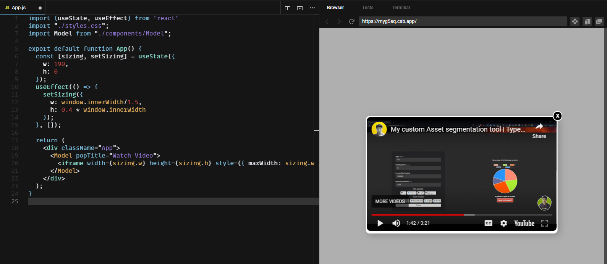

## Showing video popup


```js
import {useState, useEffect} from 'react'
import "./styles.css";
import Model from "./components/Model";

export default function App() {
  const [sizing, setSizing] = useState({
    w: 190,
    h: 0
  });
  useEffect(() => {
    setSizing({
      w: window.innerWidth/1.5,
      h: 0.4 * window.innerWidth
    });
  }, []);

  return (
    <div className="App">
      <Model popTitle="Watch Video">
        <iframe width={sizing.w} height={sizing.h} style={{ maxWidth: sizing.w }} src="https://www.youtube.com/embed/k2NaUpW4Xdc" title="Create Tabs with React !" frameborder="0" allow="accelerometer; autoplay; clipboard-write; encrypted-media; gyroscope; picture-in-picture; web-share" allowfullscreen></iframe>
      </Model>
    </div>
  );
}
```